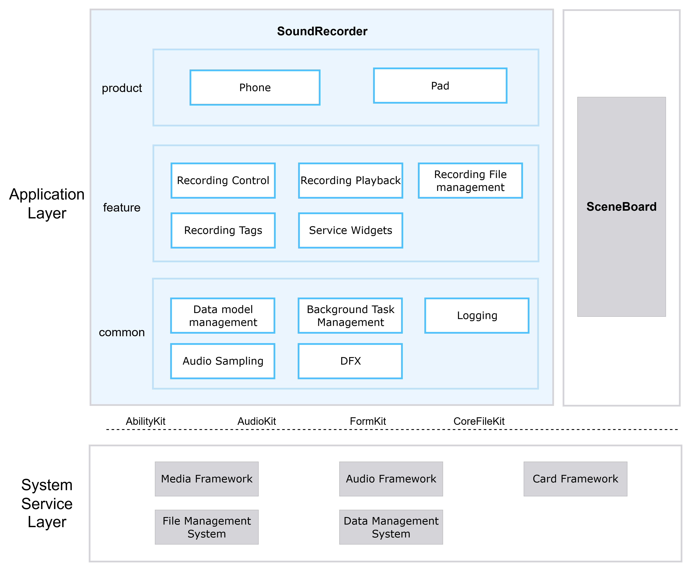

# SoundRecorder

## Introduction

**SoundRecorder** (bundle name: `com.ohos.soundrecorder`) is a pre-installed **system application** in OpenHarmony. It captures audio through the microphone, providing recording control, recording playback, recording file management, recording tags, and service widgets. It adapts to phone and tablet device forms.

This application is a system preset app. Users can enter the recorder from the desktop icon or service widgets.

### Core Capabilities

**Recording Control**
- Supports start, pause, resume, and stop, with waveform and duration display during recording.
- Supports notification / Live View controls.
- Supports background continuous task keep-alive.
- Manages the recording state machine. After recording ends, files are saved to the application directory and synchronized to the database.

**Recording Playback**
- Supports play, pause, seek, and playback speed control.
- Manages AVPlayer state and coordinates with AVSession and background playback.

**Recording File Management**
- Provides category views such as recording list and recently deleted list.
- Supports search, sorting, multi-select, swipe actions, and slide-select.
- Supports rename, view details, delete, and recover.

**Recording Tags**
- Supports adding, editing, and jumping to tags during recording or playback for quick navigation to key segments.

**Service Widgets**
- Provides 2×1 and 2×2 recording widgets for quick recording entry and status display.

## Architecture

SoundRecorder uses a layered and modular design organized by product form, business features, and common capabilities, as shown below:


### Application Layered Design

The overall structure is divided into the product layer, feature layer, and common layer:

| Layer | Main Directories / Components | Description |
| ----- | ----------------------------- | ----------- |
| Product layer | `product` | Supports phone and tablet forms |
| Feature layer | `feature/recorder`, `feature/database_manager`, `feature/file_manager`, `feature/recorderFA` | Recording control, recording playback, recording file management, recording tags, service widgets |
| Common layer | `common` | Data model management, background task management, logging, audio sampling, DFX utilities |

**Feature layer module description**:

| Core Capability | Module | Description |
| --------------- | ------ | ----------- |
| Recording control | RecordingPage, RecordManager, BaseViewModel, AudioSDKManager | Recording state machine, audio capture, waveform display |
| Recording playback | RecordPlayPage, PlayManager, AvSessionManager, MediaController | Playback control, AVSession media session, speed control |
| Recording file management | AudioRecordListComponent, DatabaseManager, FileManager, RecordWatcher | Recording list, recently deleted, search, sorting |
| Recording tags | MarkComponent, MarkListComponent | Add, edit, and jump to tags |
| Service widgets | FormAbility | Widget management, widget status sync |

### Relationship with Other Applications

SoundRecorder currently only allows calls from SceneBoard.

**Calling method**:

SoundRecorder MainAbility declares exported=true. SceneBoard can launch SoundRecorder via Want.

**Calling scenarios**:

Scenarios include desktop icon, service widgets, lock-screen entry, and notification bar.

## Build

This project is a multi-module application project, containing 1 entry HAP (`product/phone`) and 5 HAR static shared libraries (`common`, `recorder`, `recorderFA`, `database_manager`, `file_manager`). HARs are packaged into the HAP at compile time. The project is built with Hvigor, and the output is the `com.ohos.soundrecorder` system application package.

### Environment Requirements
- OpenHarmony SDK (this project uses `compileSdkVersion` 23 and `compatibleSdkVersion` / `targetSdkVersion` 20)
- DevEco Studio or command-line Hvigor toolchain
- System signing certificates (see `signature/`)

### Build Commands

Run the following in the project root:

```bash
# Open the project in DevEco Studio and Build, or use the hvigor CLI
hvigorw assembleHap
```

## SoundRecorder Development

SoundRecorder is developed in **ArkTS**, with UI based on the ArkUI Stage model. The main UI is hosted by `MainAbility`, recording/playback business is implemented in `feature/recorder`, and file/database consistency is maintained by `database_manager` / `file_manager`. Development reference: [ArkUI Development Overview](https://gitcode.com/openharmony/docs/blob/master/en/application-dev/ui/arkts-ui-development-overview.md)

### Development Based on Existing Modules

Applicable scenarios: customize existing capabilities, such as adjusting playback interaction, extending list features, modifying widget display, or optimizing delete/recover logic.

Locate the change by business boundary: `product/phone` (entry and home), `feature/recorder` (recording/playback), `feature/database_manager` (data), `feature/file_manager` (files), or `common` (shared capabilities).

The following lists some common modification scenarios:

**Scenario 1: Adjusting the recording path**
   - Page entry: `feature/recorder/src/main/ets/pages/RecordingPage.ets`
   - Business process management: `feature/recorder/src/main/ets/viewModel/BaseViewModel.ets`
   - State machine: `feature/recorder/src/main/ets/controller/RecordManager.ets`

   For example, to add a custom pre-check before recording starts, add logic in `BaseViewModel.startRecording()`:
```typescript
// BaseViewModel.ets — startRecording is the recording flow entry
public async startRecording(tag: string, context: Context, recorderStateCallback: Callback<string>,
onErrorCallback?: Callback<BusinessError>): Promise<void> {
  // [Add custom pre-check]
  if (!this.customPreCheck()) {
    return;
  }

// Original flow: permissions → config → file creation → RecordManager init
  let avProfile: media.AVRecorderProfile = { ... };
  let avConfig: media.AVRecorderConfig = { audioSourceType: media.AudioSourceType.AUDIO_SOURCE_TYPE_MIC, profile: avProfile, url: `fd://${file.fd}` };
  await RecordManager.getInstance().setAvRecorderConfig(tag, file.fd, filePath, avConfig, recorderStateCallback, this.baseRecorderStateCallback, onErrorCallback);
}
```
**Scenario 2: Adjusting the playback path**

   - Page entry: `feature/recorder/src/main/ets/pages/RecordPlayPage.ets`
   - Playback control: `feature/recorder/src/main/ets/controller/PlayManager.ets`

   For example, to add a new playback speed, extend in `PlayManager`:
```typescript
// PlayManager.ets — playback speed driven by PlaybackSpeed enum
private playSpeed: media.PlaybackSpeed = media.PlaybackSpeed.SPEED_FORWARD_1_00_X;

public setSpeed(speed: media.PlaybackSpeed): void {
 this.playSpeed = speed;
 this.audioPlayer.setSpeed(speed);
 // Sync update AVSession playback speed state
 AvSessionManager.getInstance().updatePlaybackState(this.currentTimePlay, speed, this.playerState, 'setSpeed');
}
```
**Scenario 3: Adjusting list / delete & recover:**
   - Home sync: `product/phone/src/main/ets/pages/Index.ets`
   - List components: `feature/recorder/src/main/ets/components/`
   - Data access: `DatabaseManager` facade in `common` and `feature/database_manager`

   For example, to change the Recently Deleted retention days from 30 to a custom value, modify the calculation logic in `DatabaseManager`:
```typescript
// DatabaseManager.ets — getRestDays calculates remaining days for recently deleted records
public getRestDays(delete_time: number): number {
  const deleteDuration = (Date.now() - delete_time) / (24 * 60 * 60 * 1000);
  // [Change point] reduce retention days from 30 to 15
  let restDays = 15 - Math.floor(deleteDuration);
  restDays = restDays <= 0 ? 1 : restDays;
  return restDays;
}
```
**Scenario 4: Adjusting UI components**
   - List, sidebar, waveform, and tag components are under `feature/recorder/src/main/ets/components/`.
   - Common dialogs and action bars are under `common/src/main/ets/components/`.

   For example, to globally adjust the title style, modify `@Extend(Text) recordNameStyle()`:

```typescript
// AudioRecordItemComponent.ets — modify the common style for recording names
@Extend(Text)
function recordNameStyle() {
  .fontColor($r('sys.color.ohos_id_color_text_primary'))
  .maxFontSize($r('sys.float.ohos_id_text_size_body1'))
  .minFontSize('14fp')
  .maxLines(1)
  .fontWeight(FontWeight.Medium)
  .fontSize(16)
  .textOverflow({ overflow: TextOverflow.Ellipsis })
  .maxFontScale(getContentMaxScale())
}
```

Common modification entry points:

| Target | Path |
| ------ | ---- |
| Home page | `product/phone/src/main/ets/pages/Index.ets` |
| Recording page | `feature/recorder/src/main/ets/pages/RecordingPage.ets` |
| Recording control | `feature/recorder/src/main/ets/controller/RecordManager.ets` |
| Recording playback page | `feature/recorder/src/main/ets/pages/RecordPlayPage.ets` |
| Recording file management | `feature/file_manager/`, `feature/database_manager/`, `common/src/main/ets/utils/DatabaseManager.ets` |
| Recording tag component | `feature/recorder/src/main/ets/components/MarkComponent.ets` |
| Service widgets | `product/phone/src/main/ets/widget/pages/`, `feature/recorderFA/` |
| UI components | `feature/recorder/src/main/ets/components`, `common/src/main/ets/components/` |

### Developing New Capabilities

Applicable scenarios: add recording-related capabilities, extend widget forms, introduce differentiated interaction, or adapt new device forms.

> **Note**: The current project uses a multi-module `product + feature + common` structure, with the main product entry under `product/phone`. New capabilities are usually extended within the existing layers. If a new product-form HAP is needed, add a directory under `product/` and register it in `build-profile.json5`.

**Scenario 1: Extend business capabilities**

1. Add page, controller, or ViewModel logic in `feature/recorder`.
2. If persistence is involved, extend table access in `feature/database_manager` and expose it through the `DatabaseManager` facade.
3. If file changes are involved, extend watching or file services in `feature/file_manager`.
4. If widgets are involved, extend both `feature/recorderFA` and widget pages under `product/phone`.
5. Add UT / DT cases under `product/phone/src/ohosTest` and register them in `List.test.ets`.
6. Configure / confirm Ability entry

    The project entry is already declared in `product/phone/src/main/module.json5`. When extending capabilities, usually only confirm whether permissions, Ability, Form, and shortcut configurations meet the new scenario:

    ```json
    {
      "module": {
        "name": "phone",
        "type": "entry",
        "srcEntry": "./ets/Application/MyAbilityStage.ets",
        "mainElement": "MainAbility",
        "deviceTypes": [
          "default",
          "tablet"
        ],
        "abilities": [
          {
            "name": "MainAbility",
            "srcEntry": "./ets/MainAbility/MainAbility.ets",
            "exported": true
          }
        ],
        "extensionAbilities": [
          {
            "name": "PhoneFormAbility",
            "srcEntry": "./ets/form/PhoneFormAbility.ets",
            "type": "form"
          }
        ]
      }
    }
    ```

**Scenario 2: Customize UI**

After business capabilities and Ability configuration are ready, extend the home page, recording page, playback page, list components, or widget pages as described in the previous section for UI component modification.

If a new independent page is required:
1. Add the page file under the module `pages/` directory;
2. Register it in `resources/base/profile/main_pages.json` if system route registration is needed;
3. Launch it from `Index`, Navigation, `bindSheet`, or Want routing.

## Directory Structure
```text
soundrecorder
├─AppScope                              # Application-level configuration and resources
│  ├─app.json5                          # bundleName, version, etc.
│  └─resources/                         # Global string / icon resources
├─common                                # Common capability layer
│  └─src/main/ets/
│     ├─components/                     # Shared UI components, including dialogs, action bars, list items
│     ├─constants/                      # Business constants, including recording config, playback speed, search status
│     ├─enums/                          # Business enumerations, including recording type, device type, layout dimensions
│     ├─model/                          # Shared data models, including recording state, recording record entities
│     ├─utils/                          # Common utilities, including data model management, file management
│     └─logUtils/                       # Logging framework
├─feature                               # Feature layer
│  ├─recorder/                          # Core recording and playback business
│  │  └─src/main/ets/
│  │     ├─audiokit/                    # Recording SDK wrappers
│  │     ├─components/                  # Page components, including list, waveform, sidebar, etc.
│  │     ├─controller/                  # Recording / playback controllers
│  │     ├─pages/                       # Recording, playback, about pages
│  │     ├─notification/                # Notifications and state listeners
│  │     ├─viewModel/                   # Business process management
│  │     └─service/                     # Data request services
│  ├─database_manager/                  # Recording / call / tag database
│  ├─file_manager/                      # File watching and call-recording file services
│  └─recorderFA/                        # Service widget data and control
├─product                               # Product layer
│  └─phone/                             # Phone / tablet HAP
│     └─src/main/ets/
│        ├─Application/                 # Application lifecycle management
│        ├─MainAbility/                 # Application main entry
│        ├─pages/                       # Home page
│        ├─form/                        # Service widget lifecycle management
│        └─widget/pages/                # 2×1, 2×2 widgets
├─hvigor                                # Build tool configuration
├─signature                             # Signing certificates and profile
├─open_source                           # Open-source notice materials
├─build-profile.json5                   # Project-level SDK / signing / product config
├─oh-package.json5
├─OAT.xml                               # OSS compliance audit
├─LICENSE
├─README.md                             # English documentation
└─README_zh.md                          # Chinese documentation
```

## Constraints
- **Language**: ArkTS
- **Runtime form**: system preset application (`com.ohos.soundrecorder`), depending on microphone, media playback, file access, and other system capabilities
- **Device types**: phone, tablet (see `product/phone/src/main/module.json5`)
- **Form adaptation**: different device forms change page layouts; UI changes should be verified across forms
- **Permissions**: the main permissions required by SoundRecorder are listed below (see `product/phone/src/main/module.json5`)

  | Permission | Grant Type | Usage Scenario |
  |------------|-----------|----------------|
  | ohos.permission.MICROPHONE | User authorization | Audio recording capture |
  | ohos.permission.KEEP_BACKGROUND_RUNNING | System grant | Background continuous task keep-alive during recording |
  | ohos.permission.GET_TELEPHONY_STATE | System grant | Call state monitoring, auto-pause recording on incoming call |
  | ohos.permission.MODIFY_AUDIO_SETTINGS | System grant | Audio settings |
  | ohos.permission.FILE_ACCESS_MANAGER | System grant | File access management |

- **Supported audio formats**: m4a, wav


## Contribution

Contributions of code and documentation are welcome. For contribution process details, see [Contribute](https://gitcode.com/openharmony/docs/blob/master/en/contribute/contribution-process.md).
