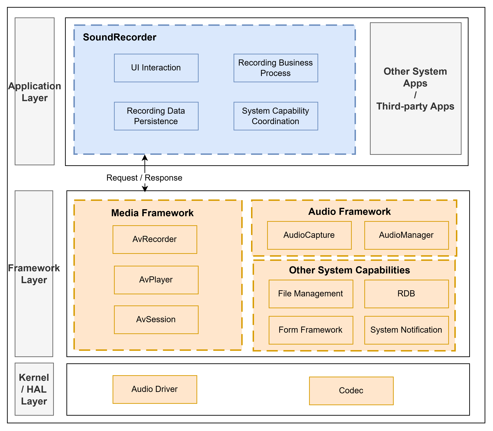

# SoundRecorder

## Introduction

**SoundRecorder** (bundle name: `com.ohos.soundrecorder`) is a pre-installed system application in OpenHarmony. It captures audio through the microphone, providing recording control, recording playback, recording file management, and recording tags. It adapts to phone and tablet device forms.

This application is a system preset app. Users can enter the recorder from the desktop icon, lock-screen entry, or service widgets.

> **Note**: This repository focuses on the SoundRecorder **application layer**. The application is responsible for UI interaction, recording business process management, recording data persistence, and widget / notification coordination. Audio capture, encoding, and system media capabilities are provided by the OpenHarmony media / audio framework.



### Core Capabilities

**Recording Control**
- Supports start, pause, resume, and stop, with waveform and duration display during recording.
- Uses `RecordManager` / `BaseViewModel` for recording state-machine management. After recording ends, files are saved to the application directory and synchronized to the database.
- Supports notification / Live View controls.
- Supports background continuous task keep-alive.

**Recording Playback**
- Supports play, pause, seek, and playback speed control.
- Uses `PlayManager` to manage AVPlayer state and coordinate with AVSession and background playback.

**Recording File Management**
- Provides category views such as All Recordings, Normal Recordings, Call Recordings, and Recently Deleted.
- When the device supports call recording, call recording files can be displayed and managed.
- Supports search, sorting, multi-select, swipe actions, and slide-select.
- Supports rename, view details, delete, and recover.

**Recording Tags**
- Supports adding, editing, and jumping to tags during recording or playback for quick navigation to key segments.

**Service Widgets and Multi-form Adaptation**
- Provides 2×1, 2×2, and lock-screen widgets for quick recording entry and status display.
- Adapts to phone and tablet forms, as well as dark mode and other system display capabilities.

### Main Business Scenarios

| Scenario | Key Modules | Application-side Handling |
| -------- | ----------- | ------------------------- |
| Recording control | `RecordingPage`, `RecordManager`, `BaseViewModel` | Permission checks, state transitions, waveform display |
| Recording playback | `RecordPlayPage`, `PlayManager` | Open file, waveform sampling, playback control, AVSession |
| Recording file management | `Index`, `AudioRecordListComponent`, `DatabaseManager`, `FileManager` | Sync All / Normal / Call / Recently Deleted data sources |
| Recording tags | `MarkComponent`, `MarkListComponent`, tag tables | Add, rename, and jump to tag positions |
| Service widgets | `PhoneFormAbility`, `recorderFA`, `widget/pages` | Launch recording from widgets and refresh status |

**Event and call flow**:
1. The application starts the home page `Index` through `MainAbility`, initializes the database, starts file watching, and loads the list.
2. After the user starts recording, `RecordingPage` is opened and `BaseViewModel` calls `RecordManager` to record and save.
3. After the user taps a list item, `RecordPlayPage` is opened and `PlayManager` handles playback and media session control.
4. Service widgets and lock-screen shortcuts launch recording or playback scenarios through Want / Form capabilities.

> For example, a typical recording flow:
> - The home page checks microphone permissions and launches `RecordingPage`;
> - `BaseViewModel.startRecording` drives `RecordManager` through prepared → started ↔ paused → released;
> - After recording ends, the file is saved, database records are written, and `eventHub` notifies the home page to refresh the list.

## Architecture

SoundRecorder uses a layered and modular design organized by product form, business features, and common capabilities, as shown below:


### Layered Design

The overall structure is divided into the product layer (Ability / home / widget entry), feature layer (recorder business), and common layer (models / components / utilities):

| Layer | Main Directories / Components | Description |
| ----- | ----------------------------- | ----------- |
| Product / system entry | `product/phone` | AbilityStage, MainAbility, home page, FormAbility, widget pages |
| Feature / recorder business | `feature/recorder`, `feature/database_manager`, `feature/file_manager`, `feature/recorderFA` | Recording/playback, database, file watching, widget data control |
| Common / basic capabilities | `common` | Shared UI components, data model management, device form detection, logging |

### Ability and UI Scenarios

The application loads the home page `Index` from `MainAbility`. The recording page is usually shown as a half-modal (`bindSheet`). Playback details use Navigation on narrow screens and can remain split on wide screens. Desktop icons and widgets can launch recording scenarios directly.

**Data flow overview**:

```text
User entry (desktop / widget / lock screen)
  → MainAbility / PhoneFormAbility
  → Index (list, sidebar, permission checks)
  → RecordingPage (record) / RecordPlayPage (play)
  → BaseViewModel / RecordManager / PlayManager
  → DatabaseManager + FileManager
  → List / widget / notification refresh
```

### Module Description

| Module | Path | Description |
| ------ | ---- | ----------- |
| AbilityStage | product/phone/src/main/ets/Application/ | Application-level lifecycle |
| MainAbility | product/phone/src/main/ets/MainAbility/ | UI main entry; loads home page and handles external Want |
| Home page | product/phone/src/main/ets/pages/Index.ets | List, sidebar, recording entry, Navigation |
| FormAbility | product/phone/src/main/ets/form/ | Service widget Ability |
| Widget pages | product/phone/src/main/ets/widget/pages/ | 2×1, 2×2, and lock-screen widgets |
| Recording/playback business | feature/recorder/ | Recording page, playback page, controllers, waveform, notifications, ViewModel |
| Database management | feature/database_manager/ | Access for normal recordings, call recordings, tags |
| File management | feature/file_manager/ | File watching and call-recording file services |
| Widget control | feature/recorderFA/ | Widget data, status sync, and updates |
| Common capabilities | common/ | Shared UI components, data model management, device form detection, logging |

## Build

This project is a multi-module HAP application built with Hvigor. The output is the `com.ohos.soundrecorder` system application package.

### Environment Requirements
- OpenHarmony / HarmonyOS SDK (this project uses `compileSdkVersion` 23 and `compatibleSdkVersion` / `targetSdkVersion` 20)
- DevEco Studio or the command-line Hvigor toolchain
- System signing certificates (see `signature/`)

### Build Commands

Run the following in the project root:

```bash
# Open the project in DevEco Studio and Build, or use the hvigor CLI
hvigorw assembleHap
```

## SoundRecorder Development

SoundRecorder is developed in **ArkTS**, with UI based on the ArkUI Stage model. The main UI is hosted by `MainAbility`, recording/playback business is implemented in `feature/recorder`, and file/database consistency is maintained by `database_manager` / `file_manager`. Development reference: [ArkUI Development Overview](https://gitcode.com/openharmony/docs/blob/master/en/application-dev/ui/arkts-ui-development-overview.md)

### Development Based on Existing Modules

Applicable scenarios: customize existing capabilities, such as adjusting playback interaction, extending list features, modifying widget display, or optimizing delete/recover logic.

**Adjusting or trimming existing modules**

1. Locate the change by business boundary: `product/phone` (entry and home), `feature/recorder` (recording/playback), `feature/database_manager` (data), `feature/file_manager` (files), or `common` (shared capabilities).
2. Adjusting the recording path:
   - Page entry: `feature/recorder/src/main/ets/pages/RecordingPage.ets`
   - Business process management: `feature/recorder/src/main/ets/viewModel/BaseViewModel.ets`
   - State machine: `feature/recorder/src/main/ets/controller/RecordManager.ets`

   For example, to add a custom pre-check before recording starts, add logic in `BaseViewModel.startRecording()`:
   ```typescript
   // BaseViewModel.ets — startRecording is the recording flow entry
   public async startRecording(tag: string, context: Context, recorderStateCallback: Callback<string>,
   onErrorCallback?: Callback<BusinessError>): Promise<void> {
     // [Add custom pre-check]
     if (!this.customPreCheck()) {
       return;
     }

   // Original flow: permissions → config → file creation → RecordManager init
     let avProfile: media.AVRecorderProfile = { ... };
     let avConfig: media.AVRecorderConfig = { audioSourceType: media.AudioSourceType.AUDIO_SOURCE_TYPE_MIC, profile: avProfile, url: `fd://${file.fd}` };
     await RecordManager.getInstance().setAvRecorderConfig(tag, file.fd, filePath, avConfig, recorderStateCallback, this.baseRecorderStateCallback, onErrorCallback);
   }
   ```
3. Adjusting the playback path:
   - Page entry: `feature/recorder/src/main/ets/pages/RecordPlayPage.ets`
   - Playback control: `feature/recorder/src/main/ets/controller/PlayManager.ets`

   For example, to add a new playback speed, extend in `PlayManager`:
   ```typescript
   // PlayManager.ets — playback speed driven by PlaybackSpeed enum
   private playSpeed: media.PlaybackSpeed = media.PlaybackSpeed.SPEED_FORWARD_1_00_X;

   public setSpeed(speed: media.PlaybackSpeed): void {
    this.playSpeed = speed;
    this.audioPlayer.setSpeed(speed);
    // Sync update AVSession playback speed state
    AvSessionManager.getInstance().updatePlaybackState(this.currentTimePlay, speed, this.playerState, 'setSpeed');
   }
   ```
4. Adjusting list / delete & recover:
   - Home sync: `product/phone/src/main/ets/pages/Index.ets`
   - List components: `feature/recorder/src/main/ets/components/`
   - Data access: `DatabaseManager` facade in `common` and `feature/database_manager`

   For example, to change the Recently Deleted retention days from 30 to a custom value, modify the calculation logic in `DatabaseManager`:
   ```typescript
   // DatabaseManager.ets — getRestDays calculates remaining days for recently deleted records
   public getRestDays(delete_time: number): number {
     const deleteDuration = (Date.now() - delete_time) / (24 * 60 * 60 * 1000);
     // [Change point] reduce retention days from 30 to 15
     let restDays = 15 - Math.floor(deleteDuration);
     restDays = restDays <= 0 ? 1 : restDays;
     return restDays;
   }
   ```
5. Adjusting UI components:
   - List, sidebar, waveform, and tag components are under `feature/recorder/src/main/ets/components/`.
   - Common dialogs and action bars are under `common/src/main/ets/components/`.

   For example, to globally adjust the title style, modify `@Extend(Text) recordNameStyle()`:
   ```typescript
   // AudioRecordItemComponent.ets — modify the common style for recording names
   @Extend(Text)
   function recordNameStyle() {
     .fontColor($r('sys.color.ohos_id_color_text_primary'))
     .maxFontSize($r('sys.float.ohos_id_text_size_body1'))
     .minFontSize('14fp')
     .maxLines(1)
     .fontWeight(FontWeight.Medium)
     .fontSize(16)
     .textOverflow({ overflow: TextOverflow.Ellipsis })
     .maxFontScale(getContentMaxScale())
   }
   ```

Common modification entry points:

| Target | Path |
| ------ | ---- |
| Home page | `product/phone/src/main/ets/pages/Index.ets` |
| Recording page | `feature/recorder/src/main/ets/pages/RecordingPage.ets` |
| Playback details page | `feature/recorder/src/main/ets/pages/RecordPlayPage.ets` |
| List / sidebar / waveform | `feature/recorder/src/main/ets/components/` |
| Service widgets | `product/phone/src/main/ets/widget/pages/`, `feature/recorderFA/` |
| Common dialogs | `common/src/main/ets/components/` |

### Developing New Capabilities

Applicable scenarios: add recording-related capabilities, extend widget forms, introduce differentiated interaction, or adapt new device forms.

> **Note**: The current project uses a multi-module `product + feature + common` structure, with the main product entry under `product/phone`. New capabilities are usually extended within the existing layers. If a new product-form HAP is needed, add a directory under `product/` and register it in `build-profile.json5`.

**Step 1: Extend business capabilities (most common)**

1. Add page, controller, or ViewModel logic in `feature/recorder`.
2. If persistence is involved, extend table access in `feature/database_manager` and expose it through the `DatabaseManager` facade.
3. If file changes are involved, extend watching or file services in `feature/file_manager`.
4. If widgets are involved, extend both `feature/recorderFA` and widget pages under `product/phone`.
5. Add UT / DT cases under `product/phone/src/ohosTest` and register them in `List.test.ets`.

**Step 2: Configure / confirm Ability entry**

The project entry is already declared in `product/phone/src/main/module.json5`. When extending capabilities, usually only confirm whether permissions, Ability, Form, and shortcut configurations meet the new scenario:

```json
{
  "module": {
    "name": "phone",
    "type": "entry",
    "srcEntry": "./ets/Application/MyAbilityStage.ets",
    "mainElement": "MainAbility",
    "deviceTypes": [
      "default",
      "tablet"
    ],
    "abilities": [
      {
        "name": "MainAbility",
        "srcEntry": "./ets/MainAbility/MainAbility.ets",
        "exported": true
      }
    ],
    "extensionAbilities": [
      {
        "name": "PhoneFormAbility",
        "srcEntry": "./ets/form/PhoneFormAbility.ets",
        "type": "form"
      }
    ]
  }
}
```

**Step 3: Customize UI**

After business capabilities and Ability configuration are ready, extend the home page, recording page, playback page, list components, or widget pages as described in the previous section "Adjusting or trimming existing modules" for UI component modification.

If a new independent page is required:
1. Add the page file under the module `pages/` directory;
2. Register it in `resources/base/profile/main_pages.json` if system route registration is needed;
3. Launch it from `Index`, Navigation, `bindSheet`, or Want routing.

## Directory Structure
```text
soundrecorder
├─AppScope                              # Application-level configuration and resources
│  ├─app.json5                          # bundleName, version, etc.
│  └─resources/                         # Global string / icon resources
├─common                                # Common capability layer
│  └─src/main/ets/
│     ├─components/                     # Shared UI components
│     ├─constants/                      # Constants
│     ├─enums/                          # Enumerations
│     ├─model/                          # Shared data models
│     ├─utils/                          # Common utilities
│     ├─tempUtils/                      # Compatibility / temporary utilities
│     └─logUtils/                       # Logging framework
├─feature                               # Feature layer
│  ├─recorder/                          # Core recording and playback business
│  │  └─src/main/ets/
│  │     ├─audiokit/                    # Recording SDK wrappers
│  │     ├─components/                  # List, waveform, sidebar, etc.
│  │     ├─controller/                  # Recording / playback controllers
│  │     ├─pages/                       # Recording, playback, about pages
│  │     ├─notification/                # Notifications and state listeners
│  │     ├─viewModel/                   # Business process management
│  │     └─service/                     # Data request services
│  ├─database_manager/                  # Recording / call / tag database
│  ├─file_manager/                      # File watching and call-recording file services
│  └─recorderFA/                        # Service widget data and control
├─product
│  └─phone/                             # Phone / tablet HAP
│     └─src/main/ets/
│        ├─Application/                 # AbilityStage
│        ├─MainAbility/                 # Main Ability
│        ├─pages/                       # Home Index
│        ├─form/                        # FormAbility
│        └─widget/pages/                # 2×1, 2×2, lock-screen widgets
├─hvigor                                # Build tool configuration
├─signature                             # Signing certificates and profile
├─open_source                           # Open-source notice materials
├─build-profile.json5                   # Project-level SDK / signing / product config
├─oh-package.json5
├─OAT.xml                               # OSS compliance audit
├─LICENSE
├─README.md                             # English documentation
└─README_zh.md                          # Chinese documentation
```

## Constraints
- Language: ArkTS
- Runtime form: system preset application (`com.ohos.soundrecorder`), depending on microphone, media playback, notification, and file-access capabilities
- Device types: `default`, `tablet` (see `product/phone/src/main/module.json5`)
- Permissions: recording requires microphone permission; reading call recordings may require media library read permission
- Form adaptation: floating window and tablet layouts change Navigation / Sheet / sidebar behavior; UI changes should be verified across forms
- This repository focuses on application-layer implementation and does not include low-level audio driver / codec source code

## Contribution

Contributions of code and documentation are welcome. For contribution process details, see [Contribute](https://gitcode.com/openharmony/docs/blob/master/en/contribute/contribution-process.md).
