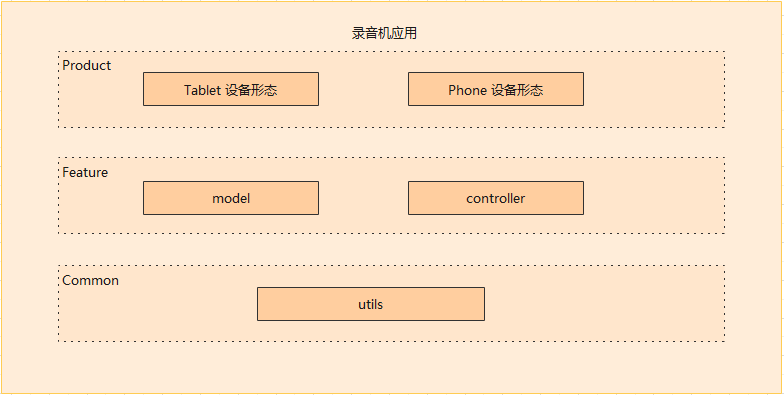
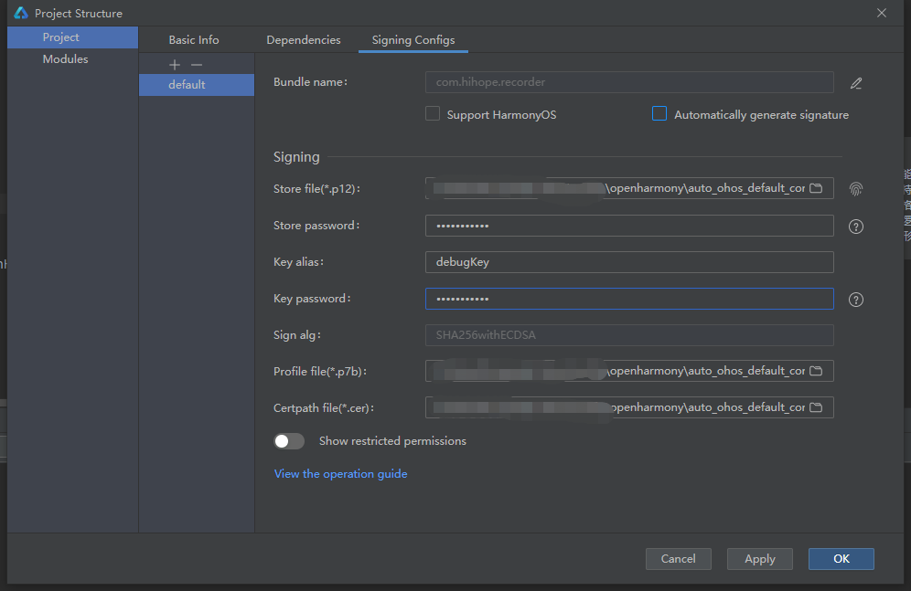
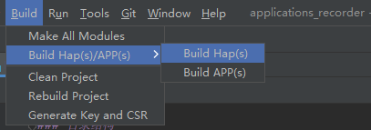
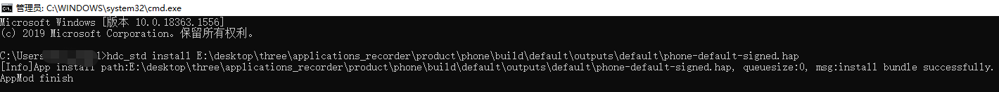

# Recorder Application 

## Introduction
The Recorder Application can record audio through a microphone and complete playback.
The Recorder Application is developed using the extended TS language (ArkTS), and the main structure is as follows:

- **Product**
  Business form layer: Distinguish different products, different screens of various forms of application, including personalized services, component configuration, and personalized resource packages(JS/PNG/String for different products).

- **Feature**
  Common Feature layer: An abstract collection of common feature components that can be referenced by various application forms(Recording, playback, control center).

- **Common**
  Common Capability Layer: The basic set of capabilities, modules that every application form must rely on, including utility classes and common resource packs.

## Directory
### Directory structure
```
/recorder/
├── common                    # Common capability level directory
├── feature                   # Public feature layer directory
│   └── model                 # Data format directory
│   └── controller            # Control logic directory
├── product                   # Business form layer directory
```

## Install
After the application is signed and packaged, run the `hdc_std install "hap package address "`command to install the application.




## Restraint
- Development environment
  - **DevEco Studio for OpenHarmony**: The Version number is greater than 3.0.0.992, download and install OpenHarmony SDK API Version 9. (You can refer to the IDE documentation for initial IDE configuration.)
- Language version
  - ArkTS
- Restrict
  - This example only supports running on standard systems