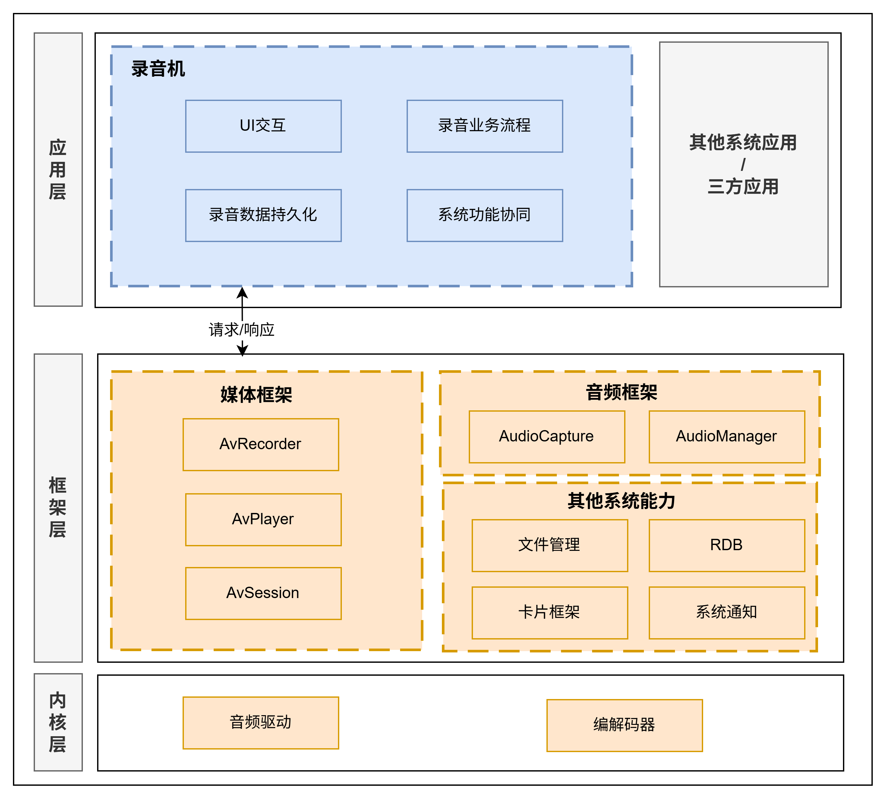

# 录音机（SoundRecorder）

## 简介

**录音机**（包名：`com.ohos.soundrecorder`）是 OpenHarmony 中预置的 **系统应用**，应用通过麦克风采集音频，提供录音控制、录音播放、录音文件管理、录音标记等能力，并适配手机、平板设备形态。

本应用为系统预置应用，用户可从桌面图标、锁屏入口或服务卡片进入录音机。

> **说明**：本仓定位为录音机**应用层**，负责 UI 交互、录音业务流程管理、录音数据持久化，以及卡片 / 通知等系统入口协同。底层音频采集、编码与系统媒体能力由 OpenHarmony 媒体 / 音频框架提供。



### 核心能力

**录音控制**
- 支持开始、暂停、继续与结束录音，录音过程中展示波形与时长。
- 通过 `RecordManager` / `BaseViewModel` 完成录音状态机管理，录音结束后将文件保存到应用目录并同步写入数据库。
- 支持通知栏 / 实况窗控制。
- 支持后台连续任务保活。

**录音播放**
- 支持播放、暂停、进度拖动与倍速播放。
- 通过 `PlayManager` 管理 AVPlayer 状态，并与 AVSession、后台播放能力协同。

**录音文件管理** 
- 提供全部录音、普通录音、通话录音、最近删除等分类视图。
- 设备具备通话录音能力时，可展示与管理通话录音文件。
- 支持搜索、排序、多选、左滑快捷操作、滑动多选。
- 支持重命名、查看详情、删除与恢复。

**录音标记**
- 录音或播放过程中可添加、编辑与跳转录音标记，便于定位关键片段。

**服务卡片与多形态适配**
- 提供 2×1、2×2 及锁屏等录音卡片，支持快捷进入录音或查看录音状态。
- 适配手机、平板形态，以及深色模式等系统显示能力。

### 主要业务场景

| 场景     | 关键模块                                                       | 应用侧处理概要                      |
|--------|------------------------------------------------------------|------------------------------|
| 录音控制   | `RecordingPage`、`RecordManager`、`BaseViewModel`            | 权限检查、状态机流转、波形展示              |
| 录音播放   | `RecordPlayPage`、`PlayManager`                             | 打开文件、波形采样、播放控制、AVSession     |
| 录音文件管理 | `Index`、`AudioRecordListComponent`、`DatabaseManager`、`FileManager`      | 同步全部 / 普通录音 / 通话录音 / 最近删除数据源 |
| 录音标记   | `MarkComponent`、`MarkListComponent`、数据库标记表                 | 添加、重命名、跳转标记位置                |
| 服务卡片   | `PhoneFormAbility`、`recorderFA`、`widget/pages`             | 卡片拉起录音、状态刷新                  |

**事件与调用关系**：
1. 应用通过 `MainAbility` 启动首页 `Index`，完成数据库初始化、文件监听与列表加载。
2. 用户触发录音后进入 `RecordingPage`，由 `BaseViewModel` 调用 `RecordManager` 完成录制与保存。
3. 用户点击列表项进入 `RecordPlayPage`，由 `PlayManager` 完成播放与媒体会话控制。
4. 服务卡片、锁屏快捷入口等通过 Want / Form 能力拉起对应录音或播放场景。

> 例如，一次典型的录音流程：
> - 首页检查麦克风等权限后拉起 `RecordingPage`；
> - `BaseViewModel.startRecording` 驱动 `RecordManager` 进入 prepared → started ↔ paused → released；
> - 录音结束后保存文件、写入数据库，并通过 `eventHub` 通知首页刷新列表。

## 架构说明

录音机采用分层与模块化设计，按产品形态、业务特性与公共能力组织代码，如图：


### 分层设计

整体可划分为产品层（Ability / 首页 / 卡片入口）、特性层（录音机业务）、公共层（模型 / 组件 / 工具）：

| 层次           | 主要目录 / 组件 | 说明                                             |
|--------------| --------------- |------------------------------------------------|
| 产品层 / 系统交互入口 | `product/phone` | AbilityStage、MainAbility、应用首页、FormAbility、卡片页面 |
| 特性层 / 录音机业务  | `feature/recorder`、`feature/database_manager`、`feature/file_manager`、`feature/recorderFA` | 录音基础功能、录音播放、录音文件管理、录音标记、服务卡片                   |
| 公共层 / 公共基础能力 | `common` | 通用UI组件、数据模型管理、设备形态检测、日志工具                      |

### Ability 与 UI 场景

应用由 `MainAbility` 加载首页 `Index`。录音页通常以半模态（`bindSheet`）展示，播放详情在窄屏下走 Navigation，在宽屏下可保持分栏；桌面图标与卡片可直接拉起录音场景。

**数据流概览**：

```text
用户入口（桌面 / 卡片 / 锁屏）
  → MainAbility / PhoneFormAbility
  → Index（列表、侧栏、权限检查）
  → RecordingPage（录音） / RecordPlayPage（播放）
  → BaseViewModel / RecordManager / PlayManager
  → DatabaseManager + FileManager
  → 列表 / 卡片 / 通知刷新
```

### 模块说明

| 模块           | 路径 | 说明                        |
|--------------| ---- |---------------------------|
| AbilityStage | product/phone/src/main/ets/Application/ | 应用级生命周期                   |
| MainAbility  | product/phone/src/main/ets/MainAbility/ | UI 主入口，加载首页并处理外部 Want     |
| 应用首页         | product/phone/src/main/ets/pages/Index.ets | 列表、侧栏、录音入口、Navigation     |
| FormAbility  | product/phone/src/main/ets/form/ | 服务卡片 Ability              |
| 卡片页面         | product/phone/src/main/ets/widget/pages/ | 2×1、2×2、锁屏卡片              |
| 录音播放业务       | feature/recorder/ | 录音页、播放页、控制器、波形、通知、ViewModel |
| 数据库管理        | feature/database_manager/ | 录音、通话录音、标记等数据访问           |
| 文件管理         | feature/file_manager/ | 文件监听、通话录音文件相关服务           |
| 卡片控制         | feature/recorderFA/ | 卡片数据、状态同步与更新              |
| 公共能力         | common/ | 通用UI组件、数据模型管理、设备形态检测、日志工具      |

## 编译构建

本工程为多模块 HAP 应用工程，使用 Hvigor 构建，产物为 `com.ohos.soundrecorder` 系统应用包。

### 环境要求
- OpenHarmony / HarmonyOS SDK（本工程 `compileSdkVersion` 为 23，`compatibleSdkVersion` / `targetSdkVersion` 为 20）
- DevEco Studio 或命令行 Hvigor 工具链
- 系统签名证书（见 `signature/`）

### 编译命令

在工程根目录执行：

```bash
# 使用 DevEco Studio 打开工程后执行 Build，或使用 hvigor 命令行
hvigorw assembleHap
```

## 录音机开发

录音机采用 **ArkTS** 语言开发，UI 基于 ArkUI Stage 模型。应用通过 `MainAbility` 承载主界面，通过 `feature/recorder` 完成录音播放业务，并通过 `database_manager` / `file_manager` 保持文件与数据库一致。开发可参考：[ArkUI 开发概述](https://gitcode.com/openharmony/docs/blob/master/zh-cn/application-dev/ui/arkts-ui-development-overview.md)

### 基于已有模块的开发

适用场景：对已有能力做功能定制，例如播放交互、扩展列表能力、修改卡片展示、优化删除恢复逻辑等。

**对已有模块的功能修改与裁剪**

1. 明确改动点：按业务边界定位到 `product/phone`（入口与首页）、`feature/recorder`（录音播放）、`feature/database_manager`（数据）、`feature/file_manager`（文件）或 `common`（公共能力）。
2. 修改录音链路：
   - 页面入口位于 `feature/recorder/src/main/ets/pages/RecordingPage.ets`
   - 业务流程管理位于 `feature/recorder/src/main/ets/viewModel/BaseViewModel.ets`
   - 状态机位于 `feature/recorder/src/main/ets/controller/RecordManager.ets`
   
    例如，需在录音开始时新增自定义前置检查，可在`BaseViewModel.startRecording()`中添加相关逻辑：
    ```typescript
    // BaseViewModel.ets — startRecording 是录音流程入口
    public async startRecording(tag: string, context: Context, recorderStateCallback: Callback<string>,
    onErrorCallback?: Callback<BusinessError>): Promise<void> {
      // 【新增自定义前置检查】
      if (!this.customPreCheck()) {
        return;
      }
    
    // 原有流程：权限 → 参数配置 → 文件创建 → RecordManager 初始化
      let avProfile: media.AVRecorderProfile = { ... };
      let avConfig: media.AVRecorderConfig = { audioSourceType: media.AudioSourceType.AUDIO_SOURCE_TYPE_MIC, profile: avProfile, url: `fd://${file.fd}` };
      await RecordManager.getInstance().setAvRecorderConfig(tag, file.fd, filePath, avConfig, recorderStateCallback, this.baseRecorderStateCallback, onErrorCallback);
    }
    ```
3. 修改播放链路：
   - 页面入口位于 `feature/recorder/src/main/ets/pages/RecordPlayPage.ets`
   - 播放控制位于 `feature/recorder/src/main/ets/controller/PlayManager.ets`

    例如，需新增一种播放速度，在`PlayManager`中扩展：
    ```typescript
    // PlayManager.ets — 播放速度由 PlaybackSpeed 枚举驱动
    private playSpeed: media.PlaybackSpeed = media.PlaybackSpeed.SPEED_FORWARD_1_00_X;
    
    public setSpeed(speed: media.PlaybackSpeed): void {
     this.playSpeed = speed;
     this.audioPlayer.setSpeed(speed);
     // 同步更新 AVSession 中的播放速度状态
     AvSessionManager.getInstance().updatePlaybackState(this.currentTimePlay, speed, this.playerState, 'setSpeed');
    }
    ```   
4. 修改列表 / 删除恢复：
   - 首页同步位于 `product/phone/src/main/ets/pages/Index.ets`
   - 列表组件位于 `feature/recorder/src/main/ets/components/`
   - 数据访问位于 `common` 的 `DatabaseManager` 及 `feature/database_manager`

    例如，若需将最近删除的保留天数从 30 天改为自定义天数，修改 `DatabaseManager` 中的计算逻辑：
    ```typescript
    // DatabaseManager.ets — getRestDays 计算最近删除记录的剩余天数
    public getRestDays(delete_time: number): number {
      const deleteDuration = (Date.now() - delete_time) / (24 * 60 * 60 * 1000);
      // 【修改点】将保留天数从 30 改为 15
      let restDays = 15 - Math.floor(deleteDuration);
      restDays = restDays <= 0 ? 1 : restDays;
      return restDays;
    }
    ```
5. 修改UI组件：
   - 列表、侧栏、波形、标记等组件位于 `feature/recorder/src/main/ets/components/`。
   - 通用弹框、操作栏等位于 `common/src/main/ets/components/`。
   
    例如，需要全局调整标题样式，直接修改`@Extend(Text) recordNameStyle()`：
    ```typescript
    // AudioRecordItemComponent.ets — 修改录音名称的通用样式
    @Extend(Text)
    function recordNameStyle() {
      .fontColor($r('sys.color.ohos_id_color_text_primary'))
      .maxFontSize($r('sys.float.ohos_id_text_size_body1'))
      .minFontSize('14fp')
      .maxLines(1)
      .fontWeight(FontWeight.Medium)
      .fontSize(16)
      .textOverflow({ overflow: TextOverflow.Ellipsis })
      .maxFontScale(getContentMaxScale())
    }
    ```   

常用修改入口：

| 目标           | 路径 |
|--------------| ---- |
| 应用首页         | `product/phone/src/main/ets/pages/Index.ets` |
| 录音页          | `feature/recorder/src/main/ets/pages/RecordingPage.ets` |
| 播放详情页        | `feature/recorder/src/main/ets/pages/RecordPlayPage.ets` |
| 列表 / 侧栏 / 波形 | `feature/recorder/src/main/ets/components/` |
| 服务卡片         | `product/phone/src/main/ets/widget/pages/`、`feature/recorderFA/` |
| 通用弹框         | `common/src/main/ets/components/` |

### 新特性能力的开发

适用场景：新增录音相关能力、扩展卡片形态、补充差异化交互或适配新设备形态。

> **说明**：当前工程采用 `product + feature + common` 多模块结构，产品入口主要在 `product/phone`。新能力一般按现有分层扩展；若新增产品形态 HAP，可在 `product/` 下增加对应目录并在 `build-profile.json5` 中注册。

**步骤1：扩展业务能力（最常见）**

1. 在 `feature/recorder` 中补充页面、控制器或 ViewModel 逻辑。
2. 如涉及持久化，在 `feature/database_manager` 中扩展表访问，并经 `DatabaseManager` 暴露。
3. 如涉及文件变化，在 `feature/file_manager` 中补充监听或文件服务。
4. 如涉及卡片，在 `feature/recorderFA` 与 `product/phone` 的 widget 页面中同步扩展。
5. 在 `product/phone/src/ohosTest` 中补充对应 UT / DT 用例，并在 `List.test.ets` 中注册。

**步骤2：配置 / 确认 Ability 入口**

本工程入口已在 `product/phone/src/main/module.json5` 中声明，扩展能力时通常只需确认权限、Ability、Form 与快捷方式配置是否满足新场景：

```json
{
  "module": {
    "name": "phone",
    "type": "entry",
    "srcEntry": "./ets/Application/MyAbilityStage.ets",
    "mainElement": "MainAbility",
    "deviceTypes": [
      "default",
      "tablet"
    ],
    "abilities": [
      {
        "name": "MainAbility",
        "srcEntry": "./ets/MainAbility/MainAbility.ets",
        "exported": true
      }
    ],
    "extensionAbilities": [
      {
        "name": "PhoneFormAbility",
        "srcEntry": "./ets/form/PhoneFormAbility.ets",
        "type": "form"
      }
    ]
  }
}
```

**步骤3：定制 UI**

在完成业务能力与 Ability 配置后，按上一节对「已有模块的功能修改与裁剪」中的 UI 组件修改方式扩展首页、录音页、播放页、列表组件或卡片页面即可。

若需新增独立页面：
1. 在对应模块 `pages/` 下新增页面文件；
2. 如需系统路由注册，在 `resources/base/profile/main_pages.json` 中声明；
3. 由 `Index`、Navigation、`bindSheet` 或 Want 路由拉起。

## 目录
```text
soundrecorder
├─AppScope                              # 应用级配置与多语言资源
│  ├─app.json5                          # bundleName、版本号等
│  └─resources/                         # 全局 string / 图标等资源
├─common                                # 公共能力层
│  └─src/main/ets/
│     ├─components/                     # 通用 UI 组件
│     ├─constants/                      # 常量
│     ├─enums/                          # 枚举
│     ├─model/                          # 公共数据模型
│     ├─utils/                          # 通用工具
│     ├─tempUtils/                      # 兼容 / 临时工具
│     └─logUtils/                       # 日志框架
├─feature                               # 特性层
│  ├─recorder/                          # 录音与播放核心业务
│  │  └─src/main/ets/
│  │     ├─audiokit/                    # 录音 SDK 封装
│  │     ├─components/                  # 列表、波形、侧栏等
│  │     ├─controller/                  # 录音 / 播放等控制器
│  │     ├─pages/                       # 录音页、播放页、关于页
│  │     ├─notification/                # 通知与状态监听
│  │     ├─viewModel/                   # 业务流程管理
│  │     └─service/                     # 数据请求服务
│  ├─database_manager/                  # 录音 / 通话 / 标记数据库
│  ├─file_manager/                      # 文件监听与通话录音文件服务
│  └─recorderFA/                        # 服务卡片数据与控制
├─product
│  └─phone/                             # 手机 / 平板形态 HAP
│     └─src/main/ets/
│        ├─Application/                 # AbilityStage
│        ├─MainAbility/                 # 主 Ability
│        ├─pages/                       # 首页 Index
│        ├─form/                        # FormAbility
│        └─widget/pages/                # 2×1、2×2、锁屏卡片
├─hvigor                                # 构建工具配置
├─signature                             # 签名证书与 profile
├─open_source                           # 开源声明材料
├─build-profile.json5                   # 工程级 SDK / 签名 / product 配置
├─oh-package.json5
├─OAT.xml                               # 开源合规审计
├─LICENSE
├─README.md                             # 英文说明文档
└─README_zh.md                          # 中文说明文档
```

## 约束
- 语言版本：ArkTS
- 运行形态：系统预置应用（`com.ohos.soundrecorder`），依赖麦克风、媒体播放、通知、文件访问等系统能力
- 设备类型：`default`、`tablet`（见 `product/phone/src/main/module.json5`）
- 权限：录音需麦克风权限；读取通话录音等场景可能依赖媒体库读取权限
- 形态适配：悬浮窗、平板等会改变 Navigation / Sheet / 侧栏布局，修改 UI 时需覆盖多形态验证
- 本仓定位为应用层实现，不包含底层音频驱动 / 编解码器源码

## 参与贡献

欢迎广大开发者贡献代码、文档等，具体的贡献流程和方式请参见[参与贡献](https://gitcode.com/openharmony/docs/blob/master/zh-cn/contribute/%E5%8F%82%E4%B8%8E%E8%B4%A1%E7%8C%AE.md)。
