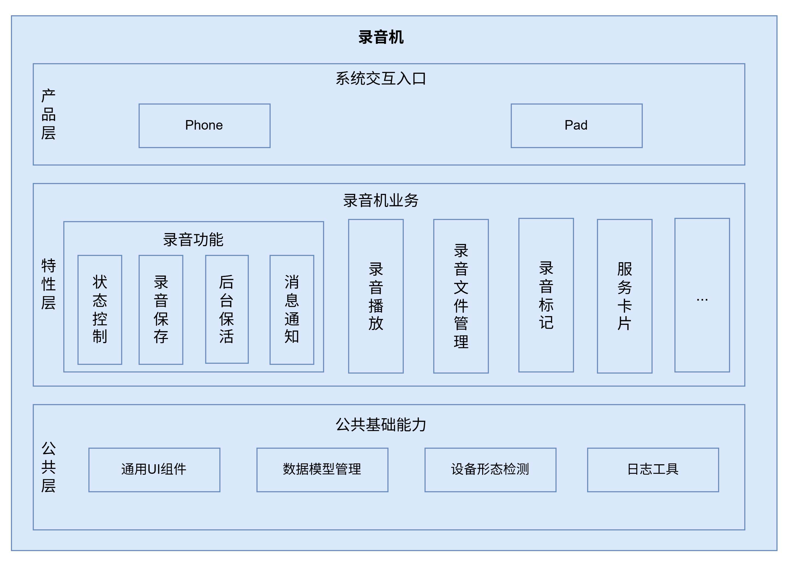

# 录音机（SoundRecorder）

## 简介

**录音机**（包名：`com.ohos.soundrecorder`）是 OpenHarmony 中预置的 **系统应用**，应用通过麦克风采集音频，提供录音控制、录音播放、录音文件管理、录音标记、服务卡片能力，并适配手机、平板设备形态。用户可从桌面图标、服务卡片进入录音机。

本应用不支持通话录音与应用内录音，遵从音频框架的音频焦点策略，只录制麦克风音频。

### 核心能力

**录音控制**
- 支持开始、暂停、继续与结束录音，录音过程中展示波形与时长。
- 支持通知栏 / 实况窗控制。
- 支持后台连续任务保活。
- 完成录音状态机管理，录音结束后将文件保存到系统公共目录`/storage/Users/currentUser/Sounds`下并同步写入数据库。

**录音播放**
- 支持播放、暂停、进度拖动与倍速播放。
- 管理 AVPlayer 状态，并与 AVSession、后台播放能力协同。

**录音文件管理** 
- 提供录音列表、最近删除列表等分类视图。
- 支持搜索、排序、多选、左滑快捷操作、滑动多选。
- 支持重命名、查看详情、删除与恢复。

**录音标记**
- 录音或播放过程中可添加、编辑与跳转录音标记，便于定位关键片段。

**服务卡片**
- 提供 2×1、2×2 等录音卡片，支持快捷录音或进入录音机。

## 架构说明

录音机采用分层与模块化设计，按产品形态、业务特性与公共能力组织代码，如图：


### 应用层分层设计

整体可划分为产品层、特性层、公共层：

| 层次   | 主要目录     | 说明     |
|------|-------------------------------------------------------------------------------------------|----------------------------------------|
| 产品层 | `product`                                                                                 | 支持手机、平板形态       |
| 特性层 | `feature/recorder`、`feature/database_manager`、`feature/file_manager`、`feature/recorderFA` | 录音控制、录音播放、录音文件管理、录音标记、服务卡片       |
| 公共层 | `common`                                                                                  | 数据模型管理、后台任务管理、日志工具、音频采样处理、DFX工具 |

**特性层模块说明**：

| 核心能力   | 模块与关键类                | 说明                      |
|--------|-----------------------------------------------------------------------------------------------------------|-------------------------|
| 录音控制   | `feature/recorder`（RecordingPage, RecordManager, BaseViewModel）                                           | 录音状态机、音频采集、波形展示         |
| 录音播放   | `feature/recorder`（RecordPlayPage, PlayManager, MediaController）	                                         | 播放控制、AVSession媒体会话、倍速播放 |
| 录音标记   | `feature/recorder`（MarkComponent, MarkListComponent）                                                      | 添加/编辑/跳转标记              |
| 录音文件管理 | `feature/file_manager`、`feature/database_manager`（AudioRecordListComponent, DatabaseManager, FileManager） | 录音列表/最近删除/搜索/排序         |
| 服务卡片   | `feature/recorderFA`（FormAbility）                                                                         | 卡片管理、卡片状态同步             |

### 与其它应用的关系

录音机目前仅允许SceneBoard从桌面图标、服务卡片入口拉起。

**调用方式**：

录音机 MainAbility 声明 exported=true，SceneBoard 可通过 Want 拉起录音机。

## 编译构建

本工程为多模块应用工程，包含 1 个入口 HAP（`product/phone`）和 5 个 HAR 静态共享库（`common`、`recorder`、`recorderFA`、`database_manager`、`file_manager`），HAR 在编译时打包进 HAP，使用 Hvigor 构建，产物为 `com.ohos.soundrecorder` 系统应用包。

### 环境要求
- OpenHarmony SDK（本工程 `compileSdkVersion` 为 26，`compatibleSdkVersion` / `targetSdkVersion` 为 20）
- DevEco Studio 或命令行 Hvigor 工具链
- 系统签名证书（见 `signature/`）

### 编译命令

在工程根目录执行：

```bash
# 使用 DevEco Studio 打开工程后执行 Build，或使用 hvigor 命令行
hvigorw assembleHap
```

## 录音机开发

录音机采用 **ArkTS** 语言开发，UI 基于 ArkUI Stage 模型。应用通过 `MainAbility` 承载主界面，通过 `feature/recorder` 完成录音播放业务，并通过 `database_manager` / `file_manager` 保持文件与数据库一致。开发可参考：[ArkUI 开发概述](https://gitcode.com/openharmony/docs/blob/master/zh-cn/application-dev/ui/arkts-ui-development-overview.md)

### 基于已有模块的开发

适用场景：对已有能力做功能定制，例如播放交互、扩展列表能力、修改卡片展示、优化删除恢复逻辑等。

明确改动点：按业务边界定位到 `product/phone`（入口与首页）、`feature/recorder`（录音播放）、`feature/database_manager`（数据）、`feature/file_manager`（文件）或 `common`（公共能力）。

以下列举一些常见的修改场景：

**场景1：修改录音链路**
   - 页面入口位于 `feature/recorder/src/main/ets/pages/RecordingPage.ets`
   - 业务流程管理位于 `feature/recorder/src/main/ets/viewModel/BaseViewModel.ets`
   - 状态机位于 `feature/recorder/src/main/ets/controller/RecordManager.ets`
   
   例如，需在录音开始时新增自定义前置检查，可在`BaseViewModel.startRecording()`中添加相关逻辑：
```typescript
// BaseViewModel.ets — startRecording 是录音流程入口
public async startRecording(tag: string, context: Context, recorderStateCallback: Callback<string>,
onErrorCallback?: Callback<BusinessError>): Promise<void> {
  // 【新增自定义前置检查】
  if (!this.customPreCheck()) {
    return;
  }

// 原有流程：权限 → 参数配置 → 文件创建 → RecordManager 初始化
  let avProfile: media.AVRecorderProfile = { ... };
  let avConfig: media.AVRecorderConfig = { audioSourceType: media.AudioSourceType.AUDIO_SOURCE_TYPE_MIC, profile: avProfile, url: `fd://${file.fd}` };
  await RecordManager.getInstance().setAvRecorderConfig(tag, file.fd, filePath, avConfig, recorderStateCallback, this.baseRecorderStateCallback, onErrorCallback);
}
```
**场景2：修改播放链路**

   - 页面入口位于 `feature/recorder/src/main/ets/pages/RecordPlayPage.ets`
   - 播放控制位于 `feature/recorder/src/main/ets/controller/PlayManager.ets`

   例如，需新增一种播放速度，在`PlayManager`中扩展：
```typescript
// PlayManager.ets — 播放速度由 PlaybackSpeed 枚举驱动
private playSpeed: media.PlaybackSpeed = media.PlaybackSpeed.SPEED_FORWARD_1_00_X;

public setSpeed(speed: media.PlaybackSpeed): void {
 this.playSpeed = speed;
 this.audioPlayer.setSpeed(speed);
 // 同步更新 AVSession 中的播放速度状态
 AvSessionManager.getInstance().updatePlaybackState(this.currentTimePlay, speed, this.playerState, 'setSpeed');
}
```   
**场景3：修改列表 / 删除恢复:**
   - 首页同步位于 `product/phone/src/main/ets/pages/Index.ets`
   - 列表组件位于 `feature/recorder/src/main/ets/components/`
   - 数据访问位于 `common` 的 `DatabaseManager` 及 `feature/database_manager`

   例如，若需将最近删除的保留天数从 30 天改为自定义天数，修改 `DatabaseManager` 中的计算逻辑：
```typescript
// DatabaseManager.ets — getRestDays 计算最近删除记录的剩余天数
public getRestDays(delete_time: number): number {
  const deleteDuration = (Date.now() - delete_time) / (24 * 60 * 60 * 1000);
  // 【修改点】将保留天数从 30 改为 15
  let restDays = 15 - Math.floor(deleteDuration);
  restDays = restDays <= 0 ? 1 : restDays;
  return restDays;
}
```
**场景4：修改UI组件**
   - 列表、侧栏、波形、标记等组件位于 `feature/recorder/src/main/ets/components/`。
   - 通用弹框、操作栏等位于 `common/src/main/ets/components/`。
   
   例如，需要全局调整标题样式，直接修改`@Extend(Text) recordNameStyle()`：

```typescript
// AudioRecordItemComponent.ets — 修改录音名称的通用样式
@Extend(Text)
function recordNameStyle() {
  .fontColor($r('sys.color.ohos_id_color_text_primary'))
  .maxFontSize($r('sys.float.ohos_id_text_size_body1'))
  .minFontSize('14fp')
  .maxLines(1)
  .fontWeight(FontWeight.Medium)
  .fontSize(16)
  .textOverflow({ overflow: TextOverflow.Ellipsis })
  .maxFontScale(getContentMaxScale())
}
```   

常用修改入口：

| 目标     | 路径                                                                                                  |
|--------|-----------------------------------------------------------------------------------------------------|
| 应用首页   | `product/phone/src/main/ets/pages/Index.ets`                                                        |
| 录音页    | `feature/recorder/src/main/ets/pages/RecordingPage.ets`                                             |
| 录音控制   | `feature/recorder/src/main/ets/controller/RecordManager.ets`                                        |
| 录音播放页  | `feature/recorder/src/main/ets/pages/RecordPlayPage.ets`                                            |
| 录音文件管理 | `feature/file_manager/`、`feature/database_manager/`、`common/src/main/ets/utils/DatabaseManager.ets` |
| 录音标记组件 | `feature/recorder/src/main/ets/components/MarkComponent.ets`                                        |
| 服务卡片   | `product/phone/src/main/ets/form`、`feature/recorderFA/`                                             |
| UI组件   | `feature/recorder/src/main/ets/components`、`common/src/main/ets/components/`                        |

### 新特性能力的开发

适用场景：新增录音相关能力、扩展卡片形态、补充差异化交互或适配新设备形态。

> **说明**：当前工程采用 `product + feature + common` 多模块结构，产品入口主要在 `product/phone`。新能力一般按现有分层扩展；若新增产品形态 HAP，可在 `product/` 下增加对应目录并在 `build-profile.json5` 中注册。

**场景1：扩展业务能力**

1. 在 `feature/recorder` 中补充页面、控制器或 ViewModel 逻辑。
2. 如涉及持久化，在 `feature/database_manager` 中扩展表访问，并经 `DatabaseManager` 暴露。
3. 如涉及文件变化，在 `feature/file_manager` 中补充监听或文件服务。
4. 如涉及卡片，在 `feature/recorderFA` 与 `product/phone` 的卡片页面中同步扩展。
5. 在 `product/phone/src/ohosTest` 中补充对应 UT / DT 用例，并在 `List.test.ets` 中注册。
6. 配置 / 确认 Ability 入口

    本工程入口已在 `product/phone/src/main/module.json5` 中声明，扩展能力时通常只需确认权限、Ability、Form 与快捷方式配置是否满足新场景：

    ```json
    {
      "module": {
        "name": "phone",
        "type": "entry",
        "srcEntry": "./ets/Application/MyAbilityStage.ets",
        "mainElement": "MainAbility",
        "deviceTypes": [
          "default",
          "tablet"
        ],
        "abilities": [
          {
            "name": "MainAbility",
            "srcEntry": "./ets/MainAbility/MainAbility.ets",
            "exported": true
          }
        ],
        "extensionAbilities": [
          {
            "name": "PhoneFormAbility",
            "srcEntry": "./ets/form/PhoneFormAbility.ets",
            "type": "form"
          }
        ]
      }
    }
    ```

**场景2：定制 UI**

在完成业务能力与 Ability 配置后，按上一节对「已有模块的功能修改与裁剪」中的 UI 组件修改方式扩展首页、录音页、播放页、列表组件或卡片页面即可。

若需新增独立页面：
1. 在对应模块 `pages/` 下新增页面文件；
2. 如需系统路由注册，在 `resources/base/profile/main_pages.json` 中声明；
3. 由 `Index`、Navigation、`bindSheet` 或 Want 路由拉起。

## 目录
```text
soundrecorder
├─AppScope                              # 应用级配置与多语言资源
│  ├─app.json5                          # bundleName、版本号等
│  └─resources/                         # 全局字符串 / 图标等资源
├─common                                # 公共能力层
│  └─src/main/ets/
│     ├─components/                     # 通用 UI 组件，包括弹框、操作栏、列表项等
│     ├─constants/                      # 业务常量，包括录音配置、播放速度、搜索状态等
│     ├─enums/                          # 业务枚举，包括录音类型、设备类型、布局尺寸等
│     ├─model/                          # 公共数据模型，包括录音状态、录音记录等数据实体
│     ├─utils/                          # 通用工具，包括数据模型管理、文件管理等
│     └─logUtils/                       # 日志框架
├─feature                               # 特性层
│  ├─recorder/                          # 录音与播放核心业务
│  │  └─src/main/ets/
│  │     ├─components/                  # 页面组件，包括列表、波形、侧栏等
│  │     ├─controller/                  # 录音 / 播放等控制器
│  │     ├─pages/                       # 录音页、播放页、关于页
│  │     ├─notification/                # 通知与状态监听
│  │     ├─viewModel/                   # 业务流程管理
│  │     └─service/                     # 数据请求服务
│  ├─database_manager/                  # 录音 / 通话 / 标记数据库
│  ├─file_manager/                      # 文件监听与通话录音文件服务
│  └─recorderFA/                        # 服务卡片数据与控制
├─product                               # 产品层
│  └─phone/                             # 手机 / 平板形态 HAP
│     └─src/main/ets/
│        ├─Application/                 # 应用生命周期管理
│        ├─MainAbility/                 # 应用主入口
│        ├─pages/                       # 首页
│        └─form/                        # 服务卡片生命周期管理、2×1、2×2卡片
├─hvigor                                # 构建工具配置
├─signature                             # 签名证书与 profile
├─open_source                           # 开源声明材料
├─build-profile.json5                   # 工程级配置
├─oh-package.json5
├─OAT.xml                               # 开源合规审计
├─LICENSE
├─README.md                             # 英文说明文档
└─README_zh.md                          # 中文说明文档
```

## 约束
- **语言版本**：ArkTS
- **运行形态**：系统预置应用（`com.ohos.soundrecorder`），依赖麦克风、媒体播放、文件访问等系统能力
- **设备类型**：手机、平板（见 `product/phone/src/main/module.json5`）
- **形态适配**：不同设备形态会改变页面布局，修改 UI 时需覆盖多形态验证
- **权限**：录音机所需的主要权限如下（见 `product/phone/src/main/module.json5`）

  | 权限 | 授权方式 | 使用场景 |
  |------|---------|------|
  | ohos.permission.MICROPHONE | 用户授权 | 录音音频采集 |
  | ohos.permission.KEEP_BACKGROUND_RUNNING | 系统授权 | 录音后台任务保活 |
  | ohos.permission.GET_TELEPHONY_STATE | 系统授权 | 通话状态监听，来电自动暂停录音 |
  | ohos.permission.FILE_ACCESS_MANAGER | 系统授权 | 文件访问管理 |

- **支持的音频格式**：m4a、wav

## 参与贡献

欢迎广大开发者贡献代码、文档等，具体的贡献流程和方式请参见[参与贡献](https://gitcode.com/openharmony/docs/blob/master/zh-cn/contribute/%E5%8F%82%E4%B8%8E%E8%B4%A1%E7%8C%AE.md)。
